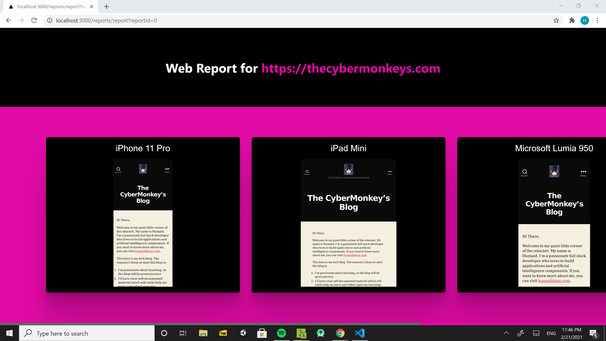

# Web-report

Description:

A website that generates simulated screenshots of your website in different browsers on various devices

# Tech Stack

-   Next
-   React
-   Node
-   Express
-   Playwright
-   Docker
-   Typescript
-   Eslint
-   Prettier

# Development:

To run this project for development,

docker-compose up

Note: If you're installing a new npm package,
you will need to rebuild your app by doing

docker-compose up --build

## **Running URL**

The back-end api will run on:

Test User:

http://localhost:5000/

Front-end:

http://localhost:3000

### Author

> [Humaid Khan](https://humaidkhan.com)
